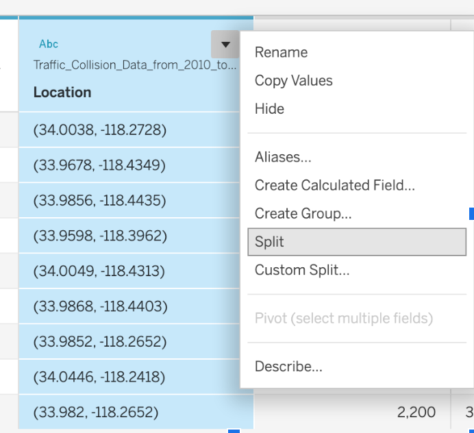
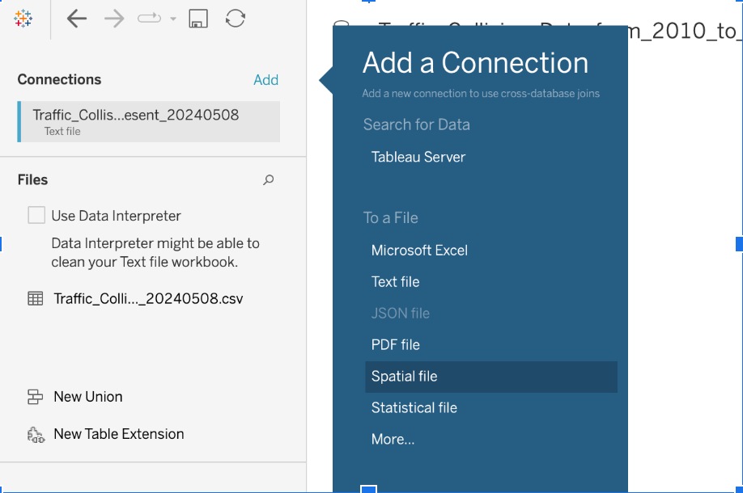

::: questions
-   How do I create a line chart, bar chart, or map in Tableau?
-   How do field types affect the kind of visualization Tableau creates?
-   How can I use geographic data for mapping?
:::

::: objectives
-   Create a line chart showing collisions over time by area.
-   Use `Hour Occurred` to build a bar chart of collisions by hour.
-   Create a basic map using latitude and longitude values.
:::

Welcome back! In this episode, we'll take the fields we've prepared and start building visualizations: a line chart, a bar chart, and a map.

## Line Chart: Collisions Over Time by Area

To start, let's visualize how the number of collisions changes over time, broken down by area. For a time series, we want time on the horizontal (x) axis.

::: checklist
## Collisions over time

1.  Open a new worksheet. Rename this sheet `Collisions Over Time`.
2.  Drag `Date Occurred` to **Columns**. It appears as a **blue pill** (discrete year headers) by default.
3.  Open the `Date Occurred` pill's dropdown menu on the Columns shelf and choose the green, continuous **Year** option (listed under the continuous, green section of the menu — distinct from the discrete blue `YEAR` above it). This turns it into a **green pill**, `YEAR(Date Occurred)`, representing a continuous timeline.
4.  Drag `Collision Count` to **Rows**.
5.  To compare areas, drag `Area Name` to **Color** on the Marks card.
:::

::: callout
## Expected outcome
At this point you should see one line per police area, all sharing a continuous year axis. If you see roughly 20 differently colored lines and it's hard to tell them apart, that's expected — we'll narrow this down next.
:::

### Too many lines to compare

With around 20 police areas, a line chart colored by `Area Name` produces about 20 lines — more than most people can visually distinguish or compare at once. Before drawing conclusions from this chart, narrow it down:

::: checklist
1.  Drag `Area Name` to the **Filters** shelf.
2.  In the filter dialog, select 4–5 areas you want to compare (for example, a mix of high- and low-collision areas), then click **OK**.
:::

With only a handful of lines, trends and crossovers become much easier to read. As an alternative to filtering, you can select a line directly in the view to highlight it against the others — useful when you want to keep all areas visible but draw attention to one.

### Renaming an axis label

To make the y-axis more readable:

- Right-click the axis → **Edit Axis...**, and set a custom title (for example, "Collision Count" instead of "CNTD(DR Number)").

::: callout
#### Continuous dates create a continuous axis

Converting `Date Occurred` to continuous doesn't add animation or automatically smooth anything — it changes how the axis is built. A discrete (blue) date field creates separate header labels, one per value. A continuous (green) date field creates a true numeric/time axis, which is what lets Tableau draw a single connected line across years instead of one segment per labeled category.
:::

## Bar Chart: Collisions by Hour of Day

Use the `Hour Occurred` calculated field from Episode 2 to see how collisions are distributed across the day.

::: checklist
1.  Create a new worksheet and rename it `Collisions by Hour`.
2.  Drag `Hour Occurred` to **Columns**.
3.  Drag `Collision Count` to **Rows**.
4.  Confirm the Marks type is **Bar**.

-   Optional: drag `Area Name` to **Filters**, then open the filter card's dropdown menu and choose **Show Filter Card**.
:::

::: callout
## Expected outcome
You should see 24 bars, one per hour (0 through 23), ordered left to right. If a given hour has zero collisions in the current filter selection, Tableau may simply omit that bar rather than show it at height zero — check the axis range if a chart looks like it's missing an hour.
:::

This is a **bar chart of collisions by hour**, not a histogram of a continuous time measure — `Hour Occurred` is a discrete category we defined ourselves (see Episode 2), not a raw continuous clock reading.

## Bar Chart: Collisions by Victim Age

Next, let's look at how collision counts vary by victim age — using **age bins**, not one bar per exact age, so the pattern is easier to read.

::: checklist
### Collisions by age

1.  Create a new worksheet and rename it `Age Distribution`.
2.  Right-click `Victim Age` in the Data pane → **Create > Bins...**
3.  Set the bin size to `10` (or `5` for finer detail) and click **OK**. This creates a new field, `Victim Age (bin)`.
4.  Drag `Victim Age (bin)` to **Columns**.
5.  Drag `Collision Count` to **Rows**.
6.  Confirm the Marks type is **Bar**.
7.  Go to **Analysis > Show Mark Labels** to display the count on top of each bar.
:::

#### Interpreting the age distribution

Look at the binned distribution. Two patterns are worth noting, but both are **hypotheses to investigate, not confirmed facts** — the chart alone can't tell us why a pattern exists, only that it does:

- If you build an *unbinned* view (one bar per exact age) you may notice spikes at ages ending in 0 or 5 (30, 35, 40, and so on). This could suggest digit preference or age estimation somewhere in the reporting process — officers rounding an approximate age rather than recording an exact one. It could also be a real feature of the population. The chart doesn't tell us which.
- You may also see a spike at age 99. A common data-entry convention in some systems is to use a placeholder value like 99 for "unknown," but **we don't have LAPD documentation confirming that's what's happening here.** Without a codebook or data dictionary from LAPD confirming this, treat it as a hypothesis, not a finding.

The source data's own documentation notes that these records were transcribed from paper traffic reports and may contain inaccuracies — a useful reminder whenever a visualization surfaces something that looks like a data artifact rather than a real-world pattern.

::: challenge
### Interpret the Distribution
1.  What would you need to see — a codebook, a data dictionary, a conversation with LAPD records staff — to confirm whether age 99 really means "unknown"?
2.  Does binning change which anomalies are visible, compared to one bar per exact age?

::: hint
Consider what kind of documentation would turn a visual hypothesis into a verified claim.
:::
:::

## Map: Plotting Collisions in Los Angeles

Now let's build a map. The dataset's `Location` field holds coordinate pairs like `"34.05, -118.24"` as a single text field, which we need to split into separate latitude and longitude fields.

::: checklist
### Splitting Location into Latitude and Longitude

1.  Open a new worksheet and rename it `Collision Map`.
2.  In the Data pane, right-click `Location` → **Transform > Custom Split...**
3.  Split on the comma (`,`) separator. If the resulting values have leading/trailing spaces, trim them (Tableau's split usually handles this, but check the preview).
4.  Rename the two resulting fields to `Latitude` and `Longitude`.
5.  Right-click each field → set **Data Type** to **Number (decimal)**.
6.  Right-click each field again → **Geographic Role** → choose `Latitude` for the `Latitude` field and `Longitude` for the `Longitude` field. A small globe icon appears next to each once set.
:::

{
alt='Data pane context menu for a text field, showing Rename, Copy Values, Hide, and further down Create Calculated Field, Create Group, Split, and Custom Split options'
width='50%'
}

::: checklist
### Building the map

7.  Double-click both `Latitude` and `Longitude` in the Data pane. Tableau places `Longitude` on **Columns** and `Latitude` on **Rows** and begins rendering a map.
8.  Drag `DR Number` to **Detail** on the Marks card.
:::

::: callout
## Expected outcome — and a common gotcha
Without a record-level dimension like `DR Number` on Detail, Tableau has nothing to tell each collision apart by, and will aggregate all the coordinates into a single averaged mark — you'll see one dot instead of thousands. Adding `DR Number` to Detail tells Tableau to draw one mark per collision record.
:::

### Cleaning up the map

The dataset uses `(0, 0)` — a real numeric coordinate pair, not a blank — as a **sentinel value** for missing location data. It is not a "null point"; it's a placeholder that happens to land off the coast of Africa on a world map, which is why filtering it out matters before you zoom to Los Angeles.

::: checklist
1.  Drag `Latitude` to the **Filters** shelf, choose **At Least**, and set a lower bound just above 0 (e.g. `1`) — or filter `Latitude` and `Longitude` to exclude exactly `0`.
2.  Use the map search/view controls in the **upper-left** of the map view to zoom to "Los Angeles, California."
3.  On the Marks card, reduce **Size** and reduce **Opacity** (via the Color menu) to make dense, overlapping points more readable.
:::

To change the basemap style:

- Go to **Map > Map Layers**, then use the **Style** dropdown under Background to choose from options such as Streets, Light, Dark, or Satellite. (Exact style names may vary slightly by version — check what's available in your installed Tableau before hard-coding a name in your own materials.)

<!-- TODO (screenshot): retake in Tableau Desktop: Public Edition 2026.2.x showing Map > Map Layers with the Style dropdown under Background. The existing fig/maps-add-streets.png shows the older Map > Background Maps > [style list] menu and should not be used for this step. -->

{
alt='The "Add a Connection" dialog in Tableau, with Spatial file highlighted as a connection type alongside Microsoft Excel, Text file, JSON file, and PDF file'
width='40%'
}

::: callout
## Location is approximate
Coordinates in this dataset are reduced-precision approximations of collision locations, not exact street addresses — a common privacy practice for public safety data. Don't treat individual points as precise addresses.
:::

::: challenge
**Optional challenge: overlay LAPD division boundaries**

If you downloaded the LAPD Divisions spatial data in Setup, try adding it as a second data source and overlaying division boundaries on your collision map as a background layer. This is an extension, not a required part of the core lesson — skip it if you're short on time.

::: hint
Connect to the spatial file the same way you'd connect to any file (`Connect > Spatial File`), then combine it with your collision map using a dual-axis or map layer approach.
:::
:::

::::: challenge
**Challenge: Compare Collisions Across Areas**

Create a bar chart showing how collision counts compare across different police areas.

-   Which field will you put on the x-axis (Columns)?
-   Which field is best for the y-axis (Rows)?
-   Can you improve the chart by adding `Color`, `Label`, or a `Filter`?

::: hint
Use `Area Name` for Columns and `Collision Count` as the measure.
:::

::: solution
-   Drag `Area Name` to **Columns**.
-   Drag `Collision Count` (`COUNTD([DR Number])`) to **Rows**.
-   Optionally add `Collision Count` to **Label** for readability.
:::
:::::

::: keypoints
-   Dragging fields to Columns and Rows defines the structure of your chart.
-   Converting a date to continuous creates a continuous axis — it does not, by itself, animate or smooth anything.
-   With ~20 categories, filter or highlight before drawing conclusions from a color-coded line chart.
-   A record-level dimension (like `DR Number`) on Detail is required for a map to plot individual points instead of one averaged mark.
-   `(0, 0)` coordinates are a numeric sentinel for missing location, not a "null point" — filter them out before setting your map extent.
:::
