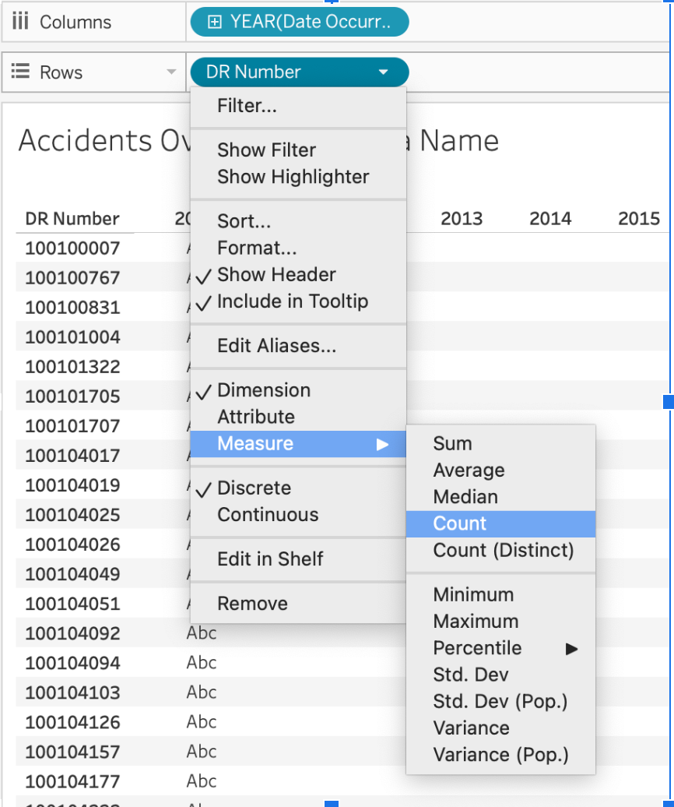
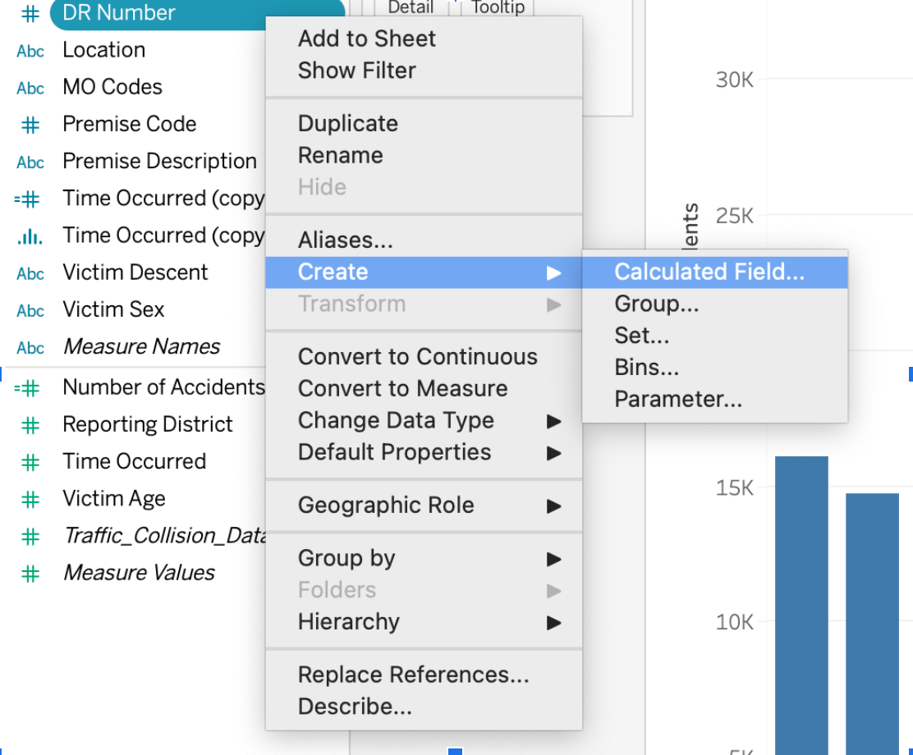

::: questions
- What is the difference between a field's data type, its role, and how it's displayed?
- What do the blue and green pill colors actually mean?
- How do I identify and prepare fields for visualization?
:::

::: objectives
- Distinguish data type, field role (dimension/measure), aggregation, and discrete/continuous — four separate concepts Tableau often shows together.
- Explore the Show Me panel to build a selected view from chosen fields.
- Create a calculated field and audit the dataset for data-quality issues.
:::

## Four things Tableau is telling you about a field

When you look at a field in the Data pane or as a pill in a view, Tableau is packing four *separate* pieces of information into how it looks. It's easy to blur them together, so let's pull them apart before we build anything:

1. **Data type** — what kind of value it holds: string, number, date, Boolean, spatial, and so on. Shown by the small icon next to the field name (`Abc`, `#`, a calendar, and so on).
2. **Field role** — whether Tableau treats it as a **dimension** (a qualitative field used to categorize and segment, like `Area Name` or `DR Number`) or a **measure** (a quantitative field meant to be aggregated, like `Victim Age`). This is a Tableau-specific classification, not the same as data type — a number can be a dimension, and text can technically be a measure.
3. **Aggregation** — for measures, how values are summarized when combined: `SUM`, `AVG`, `COUNT`, `COUNTD`, and so forth. You'll see this reflected in a pill's label, e.g. `SUM(Victim Age)`.
4. **Discrete or continuous** — whether the field creates separate header labels (discrete) or a continuous axis (continuous). This is what the pill *color* actually encodes.

::: callout
## Pro-tip: blue and green mean discrete and continuous — not dimension and measure

This is the single most common point of confusion in Tableau, so it's worth stating plainly:

- **Blue pills are discrete.** They create headers — separate labeled categories.
- **Green pills are continuous.** They create an axis — a continuous scale.

Dimensions are usually blue (discrete) and measures are usually green (continuous), which is why the two ideas get merged. But it's not a rule:

- **Dimensions can be continuous.** A date dimension, for example, can be shown as a continuous green pill so it forms a timeline axis instead of one header per year.
- **Measures can be discrete.** You can right-click a measure and convert it to discrete, which makes it behave like a category instead of a number on an axis (useful when you want one bar per age, for instance, rather than an average).

Right-click any pill in a shelf to see both toggles offered separately: **Dimension / Measure** in one section, and **Discrete / Continuous** in another. They're independent switches, not the same switch.

{
alt='Right-click menu on a pill, showing a Measure submenu (Sum, Average, Count, and so on) above a separate pair of checkboxes for Discrete and Continuous'
width='50%'
}

<!-- TODO (screenshot): this image was captured for an earlier COUNT(DR Number) workflow. It still correctly illustrates that Measure and Discrete/Continuous are separate menu sections, but a recapture using Hour Occurred in Tableau Desktop: Public Edition 2026.2.x would match this episode's content more precisely. -->
:::

## Exploring the Data with Show Me

The **Show Me** panel evaluates the fields you have selected, enables the chart types that are compatible with them, and — when you click one — builds that view for you automatically. It's a shortcut for getting a first draft of a chart, not a live preview of every possibility.

Try this:

1. Select `Area Name` and `DR Number` in the Data pane (Ctrl/Cmd-click to select both).
2. Open the **Show Me** panel and look at which chart types are enabled versus grayed out.
3. Click a chart type. Tableau builds that view using the fields you selected.

::: callout
## Expected outcome
Only chart types compatible with a text dimension (`Area Name`) and an ID-like dimension (`DR Number`) will be enabled — for example, a bar chart or a text table. Chart types that need two measures, like a scatter plot, will be grayed out.
:::

## Counting collisions: check your grain first

Before you count anything, ask: **does one row in this dataset represent one collision?** That determines how you should count.

- If one row equals one collision, Tableau's built-in generated **Count** field (right-click any field in the Data pane, or drag `Number of Records` if available) gives you an accurate count.
- If a `DR Number` (the collision report number) can repeat across rows — for example, one row per victim rather than one row per incident — a plain row count would overcount. In that case, use `COUNTD([DR Number])`, a **count distinct**, so each collision is counted once regardless of how many rows it spans.

::: challenge
## Check the grain
Drag `DR Number` to Rows and look at whether values repeat. Do you see the same `DR Number` on more than one row? What does that tell you about what a "row" represents in this dataset?

::: solution
If `DR Number` values repeat, one row does not equal one collision — use `COUNTD([DR Number])` when you need a per-collision count later in the lesson. If every `DR Number` appears exactly once, the generated `Count` field is accurate as-is.
:::
:::

For the rest of this lesson we'll build a calculated field called `Collision Count` that uses `COUNTD([DR Number])`, so it's correct either way and gives us a consistent, named field to drag into every chart from here on.

## Creating a Calculated Field

A **calculated field** lets you define a new field using a formula based on existing data. In the Data pane, calculated fields are marked with a small `=` icon — that icon means the field was calculated or copied, not that it's numeric or continuous by itself.

To create our collision-count field:

1. Go to **Analysis > Create Calculated Field**.

{
alt='Right-click context menu on a field in the Data pane, showing Create submenu with Calculated Field, Group, Set, Bins, and Parameter options'
width='50%'
}

2. Name it `Collision Count`.
3. Enter the formula: `COUNTD([DR Number])`
4. Click **OK**.

::: callout
## Expected outcome
`Collision Count` appears in the Data pane under Measures, marked with an `=` icon and shown in green (continuous) with a `#` icon, since it's a numeric aggregation. Every time you use it in a view, its pill label will read `CNTD(DR Number)`.
:::

Use `Collision Count` everywhere in this lesson that earlier drafts referred to a raw accident count — the field name stays consistent from here through the dashboard in Episode 5.

::: callout
## Troubleshooting Tip: Freezing Tableau

If Tableau freezes while you're working, it can be frustrating. Save frequently, and before experimenting with a risky change, **duplicate the worksheet** first (right-click the sheet tab → Duplicate) so you always have a stable version to go back to.
:::

## A calculated hour field: `Hour Occurred`

The dataset's `Time Occurred` field stores time as a number in `HHMM` format (e.g. `1430` for 2:30 PM), not as an actual time value. Rather than binning that number directly — which would group by arbitrary numeric ranges, not by hour — we'll write a calculated field that extracts the hour cleanly.

1. Go to **Analysis > Create Calculated Field**.
2. Name it `Hour Occurred`.
3. Enter the formula:

```text
INT([Time Occurred] / 100)
```

4. Click **OK**.

This divides the HHMM value by 100 and truncates the decimal, leaving just the hour (0–23). Right-click `Hour Occurred` in the Data pane and set it to **Discrete** — we want each hour treated as its own category (a header), not a point on a continuous numeric scale.

::: callout
## Expected outcome
`Hour Occurred` appears as a blue, discrete field. Values range from 0 through 23. In Episode 3 we'll use it to build a **bar chart of collisions by hour** — a categorical breakdown, not a histogram of a truly continuous time measure, since the underlying values are whole-number hour buckets we defined ourselves.
:::

## Bins, for comparison

Tableau's separate **bins** feature groups a continuous numeric field into equal-width intervals automatically, without you writing a formula. We'll use this in Episode 3 for `Victim Age`. The current menu path is:

1. Right-click the field in the Data pane.
2. Choose **Create > Bins...**
3. Set a bin size.

Bins are the right tool when you want equal-width numeric groups (like 5-year age bands). A calculated field like `Hour Occurred` is the right tool when the grouping logic is specific to the data's encoding (like extracting an hour from an HHMM integer).

## A short data audit

Before visualizing, it's worth spot-checking data quality. A few things to look for in this dataset:

::: challenge
## Data audit
Using Show Me, filters, or simple worksheets, investigate:

1. **Duplicate `DR Number` values** — how many collisions have more than one row?
2. **Missing or invalid dates** — are there any blank or clearly wrong `Date Occurred` values?
3. **`Time Occurred` out of range** — are all values between `0000` and `2359`?
4. **Unusual `Victim Age` values** — do any ages look implausible (very high, zero, negative)?
5. **Latitude/longitude equal to zero** — how many records have missing location, recorded as `(0, 0)`?

::: solution
There's no single right answer here — the point is to practice looking. A reasonable approach: put the field of interest on Rows, sort, and scan for outliers, or use a quick filter to isolate suspicious values (e.g. filter `Time Occurred` to values greater than 2359). We'll come back to the age and location anomalies specifically in Episode 3.
:::
:::

::: callout
## Data Exploration & Preparation

Think about what each field *represents* and how it might be grouped or summarized. Clean, consistent values make visualizations more readable and accurate. The goal of this audit isn't to fix every issue — it's to know what you're working with before you build charts on top of it.
:::

::: keypoints
- Data type, field role (dimension/measure), aggregation, and discrete/continuous are four separate concepts — Tableau just displays them together.
- Blue means discrete, green means continuous. Dimensions can be continuous; measures can be discrete.
- The `=` icon marks a calculated or copied field, not a specific data type.
- Check whether one row equals one collision before counting — use `COUNTD` if `DR Number` can repeat.
- "Show Me" evaluates your selected fields, enables compatible chart types, and builds the view you pick.
- A short data audit before visualizing surfaces problems (duplicates, invalid values, sentinel coordinates) early.
:::
