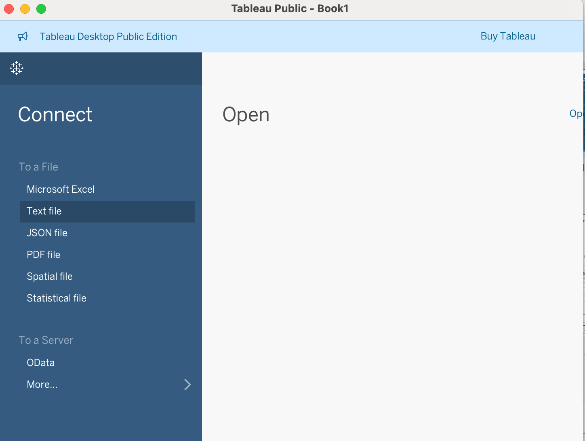
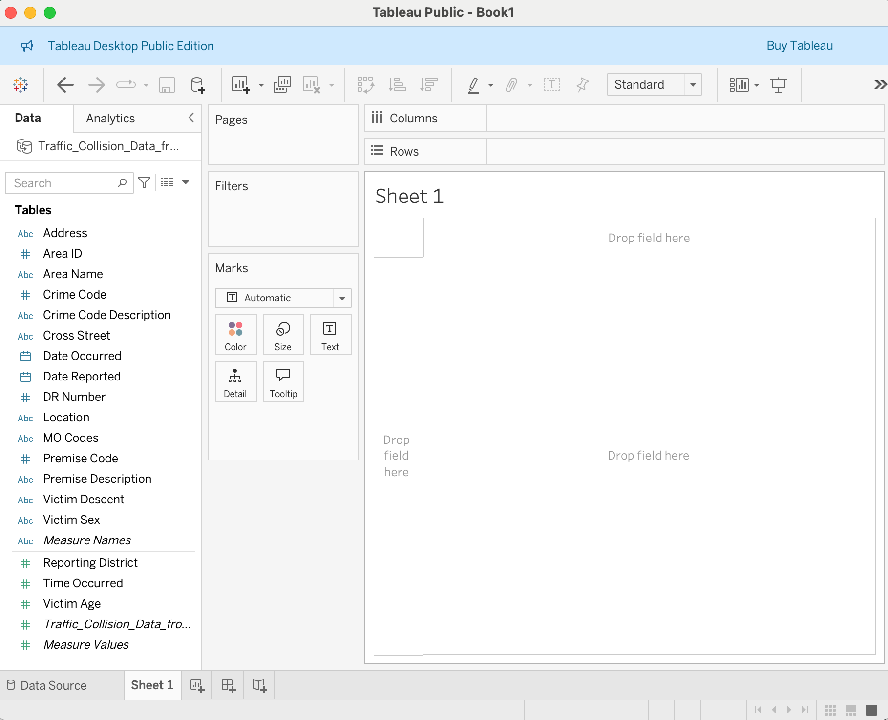

::: questions
- What is Tableau?
- What is Tableau Desktop: Public Edition, and how does it differ from a licensed edition?
- How do I install Tableau Desktop: Public Edition and open a dataset?
- What kinds of data can Tableau help me visualize?
:::

::: objectives
- Describe what Tableau is and how Public Edition compares to a licensed edition.
- Install and launch Tableau Desktop: Public Edition.
- Load a sample dataset, save it locally, and become familiar with the interface.
:::

## What is Tableau?

Tableau is a data visualization platform that enables users to explore and communicate data effectively through interactive charts, dashboards, and maps. It's widely used across many fields, including business, public policy, and research.

This workshop uses **Tableau Desktop: Public Edition** — the installed desktop application, not the web-based authoring tool at public.tableau.com. Menu paths and screenshots in this lesson describe the desktop app.

:::: caution
Tableau Public publishes workbooks to a public website, and the underlying data may be downloadable. Don't use it with sensitive or restricted data. We'll come back to this in Episode 5.
::::

## Tableau Editions

There are three current editions of Tableau Desktop:

- **Tableau Desktop: Public Edition** — free, installed application. Saves locally and publishes to Tableau Public. Not licensed for commercial use. This is what we're using today.
- **Tableau Desktop: Free Edition** — free, unlimited rows, but cannot publish anywhere (local analysis only). Useful for private, non-shareable data, but out of scope for this workshop.
- **Tableau Desktop: Professional Edition** — the fully licensed edition, available through paid or institutional licenses. Adds live database connections, unlimited data sources, and publishing to Tableau Cloud or Tableau Server in addition to Tableau Public.

### Feature comparison: Public Edition vs. Professional Edition

Table: Tableau Desktop edition comparison, validated against the [official edition comparison page](https://help.tableau.com/current/pro/desktop/en-us/desktop_comparison.htm)

| Feature                | Tableau Desktop: Public Edition | Tableau Desktop: Professional Edition |
| :--------------------- | :------------------------------- | :------------------------------------- |
| Save Locally            | Yes                               | Yes                                     |
| Row limit                | 15 million rows                  | Unlimited                               |
| Publishing destinations  | Tableau Public only               | Tableau Public, Tableau Cloud, Tableau Server |
| Data source connections  | Limited (CSV, Excel, Google Sheets, JSON, PDF, spatial files, and similar) | Full (databases, cloud services, live connections, and more) |
| Commercial use            | Not permitted                     | Permitted                               |

Everything in this workshop stays well within the Public Edition's limits.

## Launching Tableau and Connecting to Data

To get started, if Tableau Desktop (or Public) is in your dock, you can click it open. 
However, a standard method is to navigate to your Applications folder (or wherever you installed it) and launch it from there.

Once Tableau is open:

1. Under **Connect**, click **Text File**.

{
alt='Tableau Desktop: Public Edition, showing the Connect pane with "To a File" options including Text file selected'
width='50%'
}

2. Browse to your downloaded CSV file and select it.

## The Data Source page

Before building anything, Tableau shows you the **Data Source page** — a preview of your connected file. Take a moment to check it over:

- Do the field names match what you expect (`Area Name`, `Date Occurred`, `DR Number`, and so on)?
- Does each row represent one collision record? This matters later when we count accidents.
- Are date fields recognized as dates (a calendar icon next to the field), not plain text?
- Do any columns look like the wrong data type (numbers stored as text, or vice versa)?

::: callout
## Expected outcome: Data Source page
You should see a grid preview of your CSV with column headers along the top and a data-type icon (`Abc`, `#`, calendar, and so on) above each field name. If a field looks misclassified — for example, `Date Occurred` shown as `Abc` text instead of a date — you can change its data type here or later in the Data pane.
:::

3. Click **Sheet 1** at the bottom to move from the Data Source page into a new **worksheet**.

{
alt='The Data Source page after connecting a CSV file, showing a preview grid of the traffic collision data with column headers and data-type icons'
width='50%'
}

## Getting oriented in a worksheet

A **worksheet** is where you build one chart. The **view** is what actually renders in that worksheet as you add fields. A few parts of the interface you'll use constantly:

- **Data pane** — the list of fields (columns) from your connected data, on the left.
- **field** / **pill** — each item in the Data pane is a field; when you drag it into the view it becomes a small rounded box called a pill.
- **Rows shelf** and **Columns shelf** — drop pills here to define the rows and columns of your view.
- **Marks card** — controls how each data point is drawn (as a bar, line, circle, map point, and so on) and lets you add fields to Color, Size, Label, Detail, and Tooltip.

We'll use this vocabulary throughout the rest of the lesson.

## Save your work locally

Before you go further, save a local copy of your workbook:

1. Go to **File > Save As**.
2. Choose a location and file name (for example, `intro-tableau-workshop.twb`).
3. Click **Save**.

::: callout
## Expected outcome: saved workbook file
Your workbook now exists as a local `.twb` (or `.twbx`) file on your computer. Tableau Desktop: Public Edition can save locally like this at any point — you don't need to be online or publish anything to save your progress. Get in the habit of saving periodically as you work.
:::

::: keypoints
- Tableau helps you explore and present data using interactive visualizations.
- Tableau Desktop: Public Edition is free, saves locally, and publishes only to Tableau Public — not to Tableau Cloud or Tableau Server.
- A licensed Tableau Desktop: Professional Edition adds unlimited rows, live connections, and more publishing destinations.
- Check the Data Source page before building: field names, row grain, and recognized data types all matter later.
- Use well-formatted CSVs to start quickly.
:::
