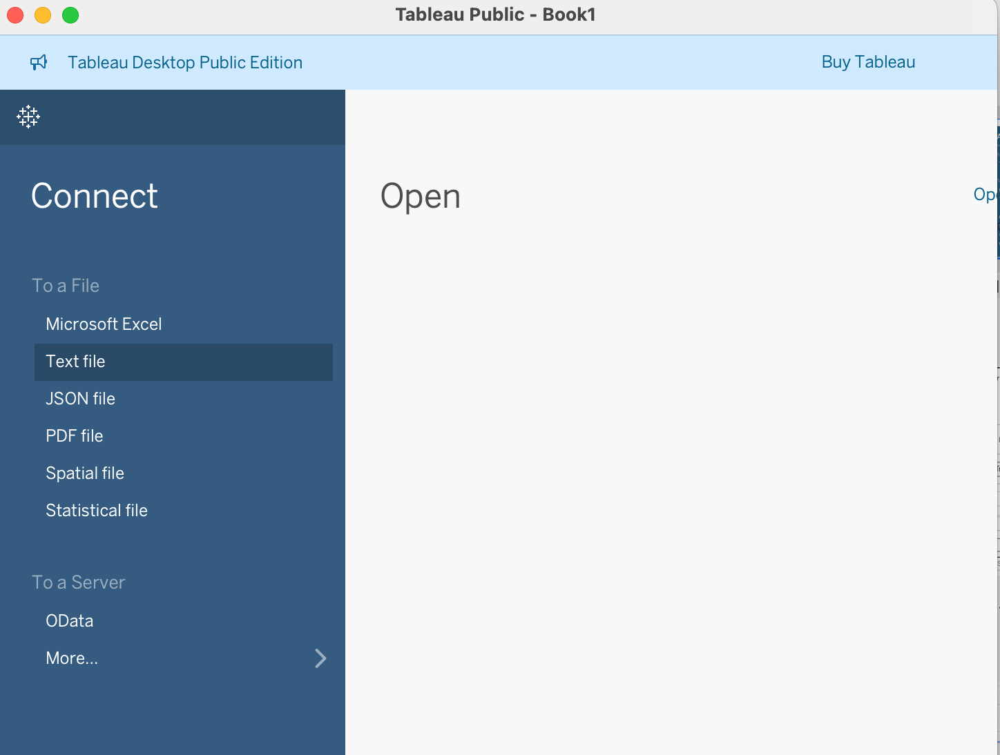
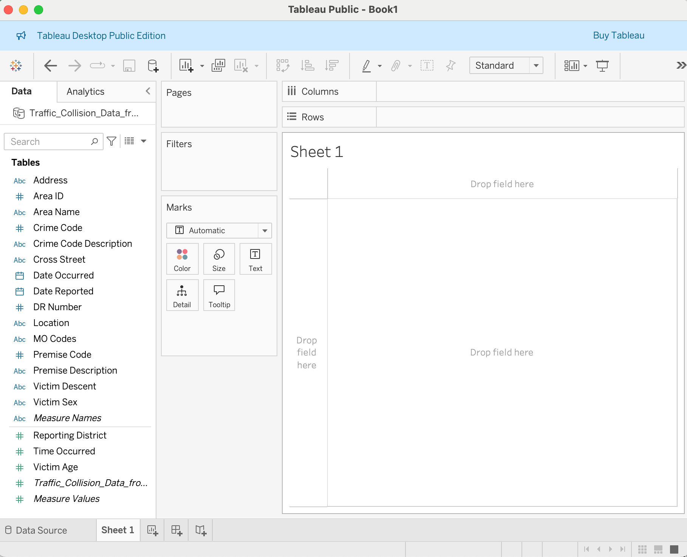

::: questions
- What is Tableau?
- What is Tableau Public?
- How do I install Tableau Public and open a dataset?
- What kinds of data can Tableau help me visualize?
:::

::: objectives
- Understand what Tableau is and the difference between the Public and Desktop versions.
- Install and launch Tableau Public.
- Load a sample dataset and become familiar with the interface.
:::

## What is Tableau?

Tableau is a data visualization platform that enables users to explore and communicate data effectively through interactive charts, dashboards, and maps. It’s widely used across many fields, including business, public policy, and research.

## Tableau Public vs. Tableau Desktop

There are two main versions of Tableau:

- **Tableau Public** is a free version that lets you create visualizations and publish them to a public web profile. It’s ideal for learning, sharing, and non-sensitive data.
- **Tableau Desktop** is the full version available through paid licenses or free academic access for students. It includes additional features like saving locally and connecting to a broader range of data sources.

### Feature Comparison Table for current Tableau Public and Desktop

Table: Comparison of Tableau Desktop and Tableau Public features as of 2025

| Feature                | Tableau Desktop              | Tableau Public (Desktop & Web)                                                 |
| :--------------------- | :--------------------------- | :----------------------------------------------------------------------------- |
| Save Locally           | Yes                          | Yes (as of 2025.1.2)                                                           |
| Private Workbooks      | Yes (local, Server, Cloud)   | No (primarily for public sharing; local saves are for personal use/prep for publish) |
| Data Sources           | Full (databases, cloud, files, etc.) | Limited (CSV, Excel, Google Sheets, JSON, PDF, Spatial Files, WDC, etc.)     |
| Live Connections       | Yes                          | No (works with data extracts/snapshots)                                        |
| Geospatial Files       | Yes                          | Yes                                                                            |
| Join/Blend Data        | Yes (full capabilities)      | Yes (for supported file types; limited cross-database/published source joins)  |
| Export Options         | PDF, PPT, Image, Data, Crosstab, etc. | Image, PDF, Data (when viewed on web); limited image export from desktop app only |
| Cost                   | Paid license (free for students) | Free                                                                           |                                                                       |

## Launching Tableau and Connecting to Data

To get started, if Tableau Desktop (or Public) is in your dock, you can click it open. 
However, a standard method is to navigate to your Applications folder (or wherever you installed it) and launch it from there.

Once Tableau is open:

1. Under **Connect**, click **Text File**.

{
alt='Open Tableau and under Connect, select Text file'
width='50%'
}

2. Browse to your downloaded CSV file and select it.
3. Tableau will show a preview of the data. Click **Sheet 1** to begin working.

{
alt='Figure: After selecting your CSV file, Tableau displays a preview of your data source. Click "Sheet 1" at the bottom to proceed to the worksheet.'
width='50%'
}

::: keypoints
- Tableau helps you explore and present data using interactive visualizations.
- Tableau Public is free and great for learning, but saves work to the web.
- Tableau Desktop provides additional functionality and is free for students.
- Use well-formatted CSVs to start quickly.
:::
