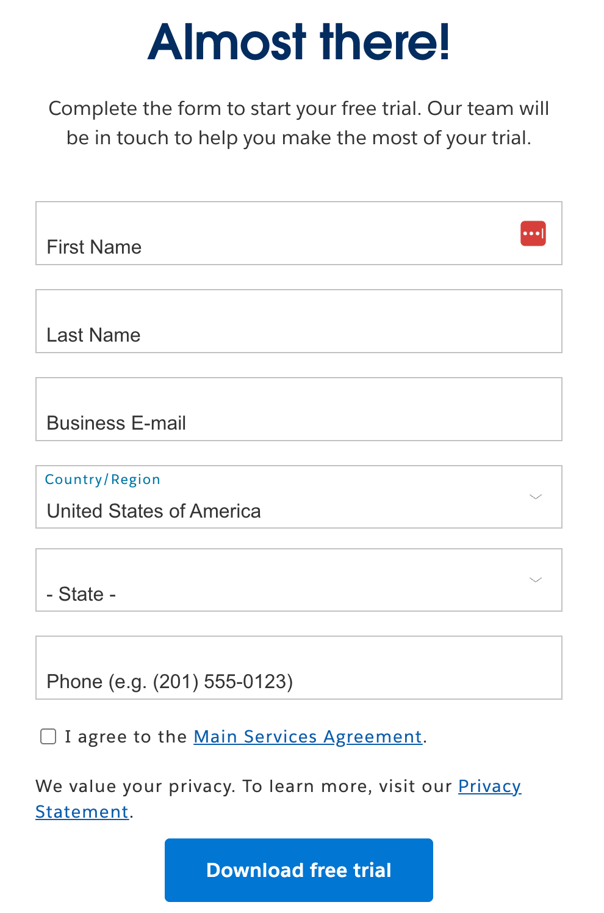
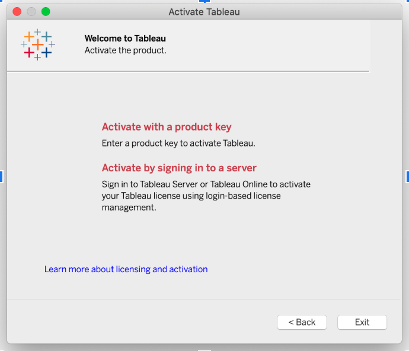

## Data Sets

Data #1: Traffic Collision Data from 2010 to Present

https://data.lacity.org/Public-Safety/Traffic-Collision-Data-from-2010-to-Present/d5tf-ez2w/about_data 

- Click ‘Export’ in the upper right-hand menu
- Make sure the export format is “CSV” (default) and click “Download”.
- Please put this in a folder where you can find it later. 

Data #2: Spatial LAPD Boundaries Data

https://geohub.lacity.org/datasets/031d488e158144d0b3aecaa9c888b7b3_0 
Click “View Full Details” in the left panel
In the new page, click “Download”
Unzip the zip file and put everything into the same folder as the earlier one

## Tableau Installation

Tableau Desktop is available free of charge to full-time students. Tableau Public is a free version that anyone can use, featuring most core features. Both are suitable for this workshop.

### Installing Tableau Public

1. Go to <https://www.tableau.com/products/public/download>
2. Enter your information and click **Download the App**.
3. Install the application following the on-screen instructions.
4. Open the app after installation.

### Installing Tableau Desktop:

1. If you are a full-time student:
2. Go to this link: <https://www.tableau.com/academic/students>
3. Click the central button “GET TABLEAU FOR FREE”
4. Enter your details 
1. Click the “VERIFY STUDENT STATUS”
1. Go to your email & find the email from Tableau with the  subject line: “Your Tableau Desktop Product Key is Enclosed”
1. Click on “Download Tableau Desktop”
1. It will download Tableau Desktop and open this tab: https://www.tableau.com/products/desktop/download?signin=academic
1. Follow the 3 steps on the website linked in step 7 (1. Download, 2. Install, 3. Register)
1. Find & Open ‘Tableau Desktop’ in your Applications

1. On this window: Follow the blue link “Activate Tableau”
1. Then this window will open and select “Activate with a product key”

If prompted to create a profile, complete the form to activate your Tableau Public account.
